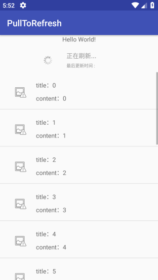
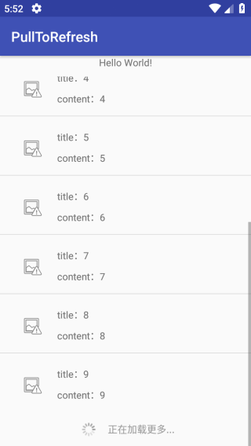
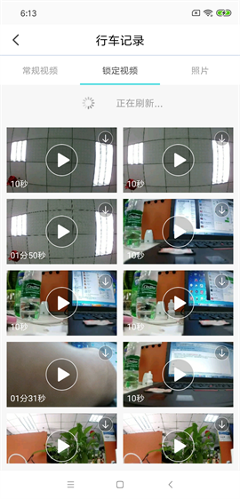
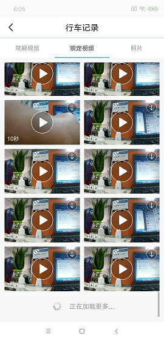
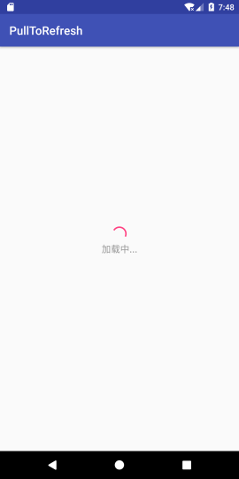
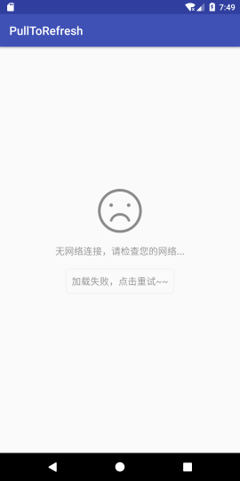

# PullToRefresh
下拉刷新，上拉加载更多的库。也可自定义进行下拉加载更多的操作。


## Features

- 下拉刷新、上拉加载更多的 Listview

- 下拉刷新、上拉加载更多的 Gridview

- 下拉刷新的 Scrollview

- 有弹性的 Scrollview

- 拥有 HeaderView 、 FooterView 的 GridView

- 通用Loading页面

  

## Code Review

```
pullToRefreshListView = (PullToRefreshListView) findViewById(R.id.refresh_listView);
pullToRefreshListView.setPullLoadEnabled(false);
pullToRefreshListView.setScrollLoadEnabled(true);//设置可滑动加载更多
pullToRefreshListView.setPullRefreshEnabled(true);//设置可下拉刷新
mListView = pullToRefreshListView.getRefreshableView();
adapter = new MyAdapter();
mListView.setAdapter(adapter);
pullToRefreshListView.setOnRefreshListener(new PullToRefreshBase.OnRefreshListener<ListView>() {
    @Override
    public void onPullDownToRefresh(PullToRefreshBase<ListView> refreshView) {
        isLoadMore = false;
        marktime = "";
        RequestRefresh("onPullDownToRefresh userid", marktime, REQUEST_NUM);
    }
    @Override
    public void onPullUpToRefresh(PullToRefreshBase<ListView> refreshView) {
        isLoadMore = true;
        RequestMoreData("onPullUpToRefresh userid", marktime, REQUEST_NUM);
    }
});
```


## Demo

   	   


          


          

## Thanks

[A GridView which can addHeaderView and addFooterView](https://github.com/liaohuqiu/android-GridViewWithHeaderAndFooter) 

[loadinglayout](https://github.com/czy1121/loadinglayout)


## gradle  [](https://jitpack.io/#cheng2016/PullToRefresh)
    implementation 'com.github.cheng2016:PullToRefresh:V1.0.0'
<br/>


## Contact Me

- Github: github.com/cheng2016
- Email: mitnick.cheng@outlook.com
- QQ: 1102743539


# License

    Copyright 2016 cheng2016,Inc.
    
    Licensed under the Apache License, Version 2.0 (the "License");
    you may not use this file except in compliance with the License.
    You may obtain a copy of the License at
    
        http://www.apache.org/licenses/LICENSE-2.0
    
    Unless required by applicable law or agreed to in writing, software
    distributed under the License is distributed on an "AS IS" BASIS,
    WITHOUT WARRANTIES OR CONDITIONS OF ANY KIND, either express or implied.
    See the License for the specific language governing permissions and
    limitations under the License.
